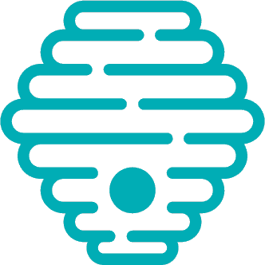
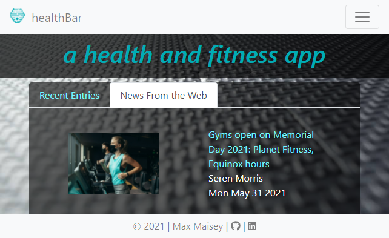

<!-- PROJECT LOGO -->
<br />
<p align="center">
  <a href="https://healthbar-fe.herokuapp.com/">
    
  </a>

  <h3 align="center">healthBar</h3>


<!-- TABLE OF CONTENTS -->
<details open="open">
  <summary>Table of Contents</summary>
  <ol>
    <li>
      <a href="#about-the-project">About The Project</a>
      <ul>
        <li><a href="#built-with">Built With</a></li>
      </ul>
    </li>
    <li>
      <a href="#getting-started">Getting Started</a>
      <ul>
        <li><a href="#prerequisites">Prerequisites</a></li>
        <li><a href="#installation">Installation</a></li>
      </ul>
    </li>
    <li><a href="#usage">Usage</a></li>
    <li><a href="#roadmap">Roadmap</a></li>
    <li><a href="#contributing">Contributing</a></li>
    <li><a href="#contact">Contact</a></li>
  </ol>
</details>


<!-- ABOUT THE PROJECT -->
## About The Project

<p align="center">
  <a href="https://healthbar-fe.herokuapp.com/">
    
  </a>
</p>

<p align="center">
Welcome to the healthBar! Your source for health and fitness information and news!
</p>

<p align="center">
You can browse, search, and create your own account to track your exercise routines and goals!
</p>

### Built With

* [Flask](https://flask.palletsprojects.com/en/2.0.x/)
* [React](https://reactjs.org/)
* [Bootstrap](https://getbootstrap.com)
* [tinyMCE](https://tiny.cloud)
* [NewsCatcher](https://newscatcherapi.com/)


<!-- GETTING STARTED -->
## Getting Started

This is the react frontend for the healthBar app.
To get a local copy up and running follow these simple example steps.

### Prerequisites

Make sure you have npm installed and up to date:
* npm
  ```sh
  npm install npm@latest -g
  ```

### Installation

1. Get a free tinyMCE API Key at [https://tiny.cloud/](https://tiny.cloud/)
2. Get a free NewsCatcher API Key at [https://newscatcherapi.com/](https://newscatcherapi.com/)
3. Clone the repo
   ```sh
   git clone https://github.com/your_username_/Project-Name.git
   ```
4. Install NPM packages
   ```sh
   npm install
   ```
5. Enter the following variables in `.env`
   ```JS
   REACT_APP_BASEURL=http://localhost:8000
   REACT_APP_USERENDPT=/users
   REACT_APP_ARTICLEENDPT=/api/v1/articles
   REACT_APP_NEWSKEY={YourNewsCatcherAPIKey}
   REACT_APP_TINYKEY={YourtinyMCEAPIKey}
   ```
6. To spin up the database, cd into the project folder and run:
   ```sh
   npm start
   ```


<!-- USAGE EXAMPLES -->
## Usage

1. Users can search/browse through entries, other users, and news from the web.
2. Users can register for an account, login to their accounts once registered, and update or delete their account information.
3. There are different account tiers: 1) user, 2) professional, and 3) admin.
4. Tier 1 users can add new entries, edit/delete their own entries, and comment on other users' entries.
5. Tier 1 users can also upload their health/fitness credentials if they wish to be considered for tier 2.
6. Tier 2 users have all the capabilities of tier 1 users, plus the ability to endorse entries. Their endorsement will show on the entry and allow users to filter entries based on endorsements.
7. Tier 3 users have all the capabilities of tier 1 and 2 users, plus full admin capabilities. They can edit or delete any entry, credential, comment, or user.
8. Tier 3 users also have the ability to change users' user type (between any of the three tiers).


<!-- ROADMAP -->
## Roadmap

See the [open issues](https://github.com/keyofbpoe1/healthbar-be/issues) for a list of proposed features (and known issues).


<!-- CONTRIBUTING -->
## Contributing

Contributions are what make the open source community such an amazing place to be learn, inspire, and create. Any contributions you make are **greatly appreciated**.

1. Fork the Project
2. Create your Feature Branch (`git checkout -b feature/AmazingFeature`)
3. Commit your Changes (`git commit -m 'Add some AmazingFeature'`)
4. Push to the Branch (`git push origin feature/AmazingFeature`)
5. Open a Pull Request


<!-- CONTACT -->
## Contact

Github: [https://github.com/keyofbpoe1](https://github.com/keyofbpoe1)

Linkedin: [https://www.linkedin.com/in/smax-maisey/](https://www.linkedin.com/in/smax-maisey/)

Live Project Link: [https://healthbar-fe.herokuapp.com/](https://healthbar-fe.herokuapp.com/)


<!-- MARKDOWN LINKS & IMAGES -->
<!-- https://www.markdownguide.org/basic-syntax/#reference-style-links -->
[product-logo]: images/hb-favicon.png
[product-screenshot]: images/screenshot.png
